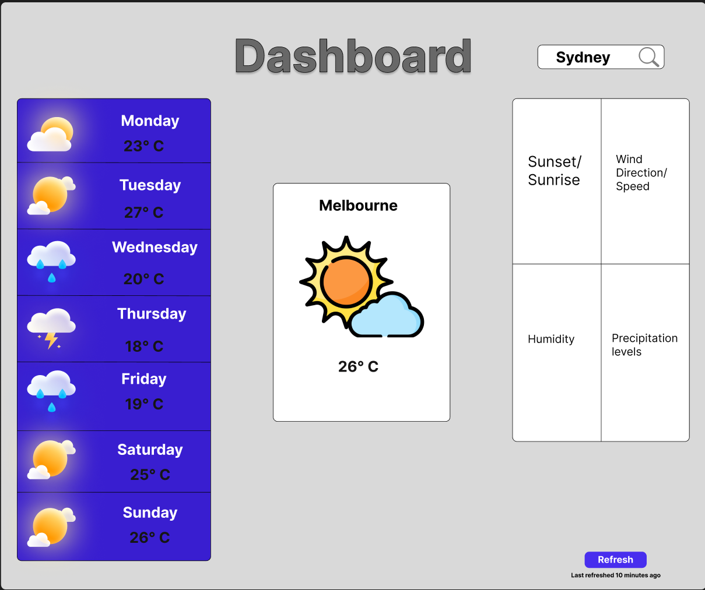

# WeatherDashboard

## Planning

### Plan

**Overview:** Building a project of a weather dashboard to try and build on my coding abilities. Dashboard will include HTML, CSS and JavaScript on the frontend with the design and layout to help with building the foundation while Python will be used on the backend to ensure I am confident in coding in python. Flask as the framework will tie the two together.

**Goals:** The thing that I want to achieve the most out of this is to build on the foundations that I already know and gain confidence in my ability to code without guidance. This project will hopefully allow me to learn more about backend and frontend language and ensure that I can apply this to real world scenarios.

**Main Features:**

- Main section that highlights the temperature/weather on that day which includes the location, weather (in degrees) and time
- Subsections will include the ability to display weekly weather hopefully incorporating images of whether it will be cloudy, raining or sunny along with the degrees.
- Optional
    Including wind direction, speed and humidity

## Design

### Wireframes

### Pages

- Just one page of information that includes weekly weather showing from Monday to Sunday, a main section with the daily weather, location and degrees (in Celsius) and finally a 3rd section that shows extra information including how fast the wind is traveling, the time of sunset and sunrise for that day, precipitation levels and humidity for that day.

### Plan Navigation

It is going to be a single page with information, everything will be already displayed on the front page with the daily weather taking up the center as it is the main detail.

### Data Flow

The data flow will be requested by the user which will go to the weather API which fetches the data. The fetched data will have to updated every 10 minutes to ensure that weather is captured on a regular basis to showcase the forecast for that specific time for all the information that is needed. This updated information will then be formatted into the dashboard and then displayed back to the user.

## Set Up

### Tech Stack

- **F**rontend: HTML, CSS, JavaScript
- **B**ackend: Python
- **F**ramework: Flask
